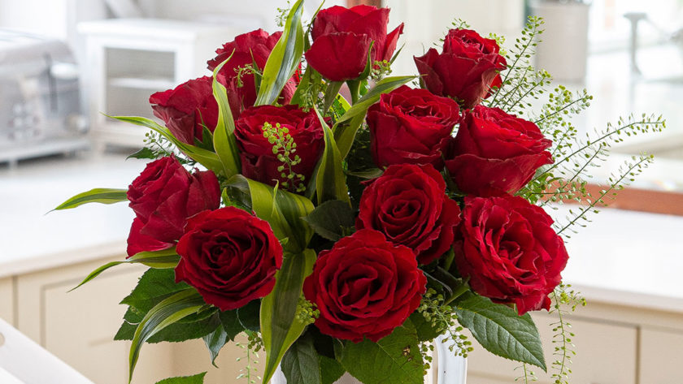

# ai-vision-tool

[](https://pypi.org/project/ai-vision-tool/)
[](https://pypi.org/project/ai-vision-tool/)
[](https://pypi.org/project/ai-vision-tool/)

**ai-vision-tool** is a modular computer-vision toolkit built around composable pipeline
components. It provides preprocessing, augmentation, webcam capture, dataset collection,
and an HTTP service layer — all usable from Python, the command line, or a FastAPI server.



## Table of Contents

- [Features](#features)
- [Installation](#installation)
- [Quickstart](#quickstart)
- [Preprocessing](#preprocessing)
- [Augmentation](#augmentation)
- [Pipeline](#pipeline)
- [Components](#components)
- [Capture Templates](#capture-templates)
- [FastAPI Service](#fastapi-service)
- [CLI Reference](#cli-reference)
- [Component Index](#component-index)
- [Output Structure](#output-structure)
- [Testing](#testing)
- [Build and Publish](#build-and-publish)

## Features

- Composable pipeline via `AIVisionPipeline` — chain any mix of components with one interface
- 40+ preprocessing transforms: geometry, intensity, color space, quality checks, segmentation
- 70+ augmentation components: geometric, weather, blur, noise, dropout, multi-image composition
- Webcam capture, burst, ROI crop, time-lapse, and video recording helpers
- Dataset collection with label-aware folder structure
- FastAPI service layer for HTTP-based image processing
- CLI with live augmentation profile loading from JSON
- Optional TensorFlow and Darknet auto-labeler integrations

---

## Installation

### pip

```bash
pip install ai-vision-tool
```

With optional TensorFlow integration:

```bash
pip install "ai-vision-tool[tensorflow]"
```

### uv

```bash
uv add ai-vision-tool
```

With optional TensorFlow integration:

```bash
uv add "ai-vision-tool[tensorflow]"
```

### Poetry

```bash
poetry add ai-vision-tool
```

With optional TensorFlow integration:

```bash
poetry add --extras tensorflow ai-vision-tool
```

### Development Setup

Clone the repository and install all dev dependencies:

```bash
git clone https://github.com/your-org/ai-vision-tool.git
cd ai-vision-tool

# Using uv
uv sync --dev

# Using Poetry
poetry install --with dev
```

Install pre-commit hooks (required for formatting, linting, and commit validation):

```bash
pre-commit install
pre-commit install --hook-type pre-push
pre-commit install --hook-type commit-msg
```

Run the full hook suite manually:

```bash
pre-commit run --all-files
```

---

## Quickstart

Install the package and run this to process your first image through a pipeline in under
30 seconds. The example loads a real image, runs four components in sequence, and prints
the output shape.

```python
import cv2
from ai_vision_tool.pipeline import AIVisionPipeline
from ai_vision_tool.components.preprocessing import AutoOrient, AutoAdjustContrast
from ai_vision_tool.components.augmentations import Flip, GaussianBlur

# Load image
image = cv2.imread("images/github/sample.jpg")

# Build a pipeline
pipeline = AIVisionPipeline()
pipeline.add(AutoOrient(rotation=90))
pipeline.add(AutoAdjustContrast(method="adaptive_equalization", clip_limit=2.0))
pipeline.add(Flip(horizontal=True))
pipeline.add(GaussianBlur(kernel_size=5, sigma_x=1.0))

# Execute
result = pipeline.execute(
    initial_data={"frame": image},
    global_config={},
)

output = result["frame"]
print(output.shape)  # (height, width, 3)
```

You can also import any component directly from the top-level namespace:

```python
from ai_vision_tool import AutoOrient, Flip, GaussianBlur, AIVisionPipeline
```

All imports use lazy loading, so only the modules you actually use are loaded.

---

## Preprocessing

Preprocessing transforms prepare raw images for downstream model inference, quality gating,
or dataset ingestion. Every component accepts either a NumPy array or a payload dictionary
`{"frame": ndarray, ...}`.

```python
import cv2
image = cv2.imread("images/github/sample.jpg")
```

### Import Path

```python
from ai_vision_tool.components.preprocessing import (
    AutoOrient,
    AutoAdjustContrast,
    Resize,
    LetterboxResize,
    CenterCrop,
    PadToSquare,
    Normalize,
    Standardize,
    RescalePixels,
    ConvertColorSpace,
    BGRToRGB,
    RGBToBGR,
    CLAHE,
    HistogramEqualization,
    GammaCorrection,
    WhiteBalance,
    Denoise,
    Sharpen,
    Deblur,
    RemoveBackground,
    Threshold,
    AdaptiveThreshold,
    EdgeDetection,
    ContourExtraction,
    PerspectiveCorrection,
    Deskew,
    AutoCrop,
    FaceAlign,
    ObjectCrop,
    BoundingBoxClamp,
    BoundingBoxNormalize,
    MaskResize,
    ImageQualityCheck,
    BlurDetection,
    BrightnessCheck,
    DuplicateImageCheck,
    CorruptImageCheck,
    AspectRatioFilter,
    MinSizeFilter,
    MaxSizeFilter,
)
```

---

### Geometry

Geometry transforms resize, crop, pad, and rectify images to a consistent spatial format.
They are typically the first stage in any preprocessing pipeline.

**`AutoOrient`** — Correct EXIF orientation metadata or apply an explicit rotation and flip.

```python
from ai_vision_tool.components.preprocessing import AutoOrient

# Rotate 90 degrees clockwise
result = AutoOrient(rotation=90).run(image)

# Flip horizontally without rotation
result = AutoOrient(flip_horizontal=True).run(image)

# Honour EXIF orientation tag stored in a payload dict
result = AutoOrient(use_exif=True, exif_key="exif_orientation").run(
    {"frame": image, "exif_orientation": 6}
)
```

**`Resize`** — Resize to an exact target size, ignoring aspect ratio.

```python
from ai_vision_tool.components.preprocessing import Resize

result = Resize(width=640, height=640).run(image)
```

**`LetterboxResize`** — Resize while preserving aspect ratio, padding the shorter axis.

```python
from ai_vision_tool.components.preprocessing import LetterboxResize

result = LetterboxResize(width=640, height=640, pad_value=(114, 114, 114)).run(image)
```

**`CenterCrop`** — Crop the centre region for classification inputs.

```python
from ai_vision_tool.components.preprocessing import CenterCrop

result = CenterCrop(width=224, height=224).run(image)
```

**`PadToSquare`** — Pad a rectangular image to a square canvas.

```python
from ai_vision_tool.components.preprocessing import PadToSquare

result = PadToSquare(pad_value=(0, 0, 0)).run(image)
```

**`PerspectiveCorrection`** — Rectify a quadrilateral document or planar surface.

```python
import numpy as np
from ai_vision_tool.components.preprocessing import PerspectiveCorrection

source_points = np.float32([[30, 20], [310, 10], [320, 240], [20, 250]])
result = PerspectiveCorrection(
    source_points=source_points,
    output_size=(300, 200),
).run(image)
```

**`Deskew`** — Rotate a document back to a levelled angle using skew estimation.

```python
from ai_vision_tool.components.preprocessing import Deskew

result = Deskew().run(image)
```

**`AutoCrop`** — Trim empty or near-black borders from around the active subject.

```python
from ai_vision_tool.components.preprocessing import AutoCrop

result = AutoCrop(threshold=10, padding=4).run(image)
```

**`FaceAlign`** — Align a face using eye landmark coordinates stored in a payload dict.

```python
from ai_vision_tool.components.preprocessing import FaceAlign

payload = {
    "frame": image,
    "metadata": {
        "left_eye": (40, 50),
        "right_eye": (90, 50),
    },
}
result = FaceAlign(output_size=(112, 112)).run(payload)
```

**`ObjectCrop`** — Crop the region described by bounding boxes in a payload dict.

```python
from ai_vision_tool.components.preprocessing import ObjectCrop

payload = {"frame": image, "bboxes": [(10, 20, 120, 80)]}
result = ObjectCrop().run(payload)
```

**`BoundingBoxClamp`** — Clamp bounding boxes that extend outside image boundaries.

```python
from ai_vision_tool.components.preprocessing import BoundingBoxClamp

payload = {"frame": image, "bboxes": [(-5, -5, 80, 90)]}
result = BoundingBoxClamp().run(payload)
```

**`BoundingBoxNormalize`** — Normalise absolute pixel bounding boxes to relative coordinates.

```python
from ai_vision_tool.components.preprocessing import BoundingBoxNormalize

payload = {"frame": image, "bboxes": [(10, 20, 120, 80)]}
result = BoundingBoxNormalize().run(payload)
```

**`MaskResize`** — Resize a payload mask to match a target spatial size.

```python
import numpy as np
from ai_vision_tool.components.preprocessing import MaskResize

mask = np.zeros((image.shape[0], image.shape[1]), dtype=np.uint8)
payload = {"frame": image, "mask": mask}
result = MaskResize(width=640, height=640).run(payload)
```

---

### Intensity and Color

Intensity and color transforms normalise pixel values, adjust exposure, and convert between
color spaces. Apply these after geometry but before feeding arrays into a model.

**`AutoAdjustContrast`** — Adaptive equalization, histogram equalization, or contrast stretching.

```python
from ai_vision_tool.components.preprocessing import AutoAdjustContrast

# Adaptive equalization (default)
result = AutoAdjustContrast(method="adaptive_equalization", clip_limit=2.0).run(image)

# Histogram equalization
result = AutoAdjustContrast(method="histogram_equalization").run(image)

# Contrast stretching between percentile bounds
result = AutoAdjustContrast(
    method="contrast_stretching",
    lower_percentile=2.0,
    upper_percentile=98.0,
    output_min=0,
    output_max=255,
).run(image)
```

**`Normalize`** — Map pixel values into [0, 1] (or a custom range).

```python
from ai_vision_tool.components.preprocessing import Normalize

result = Normalize().run(image)
```

**`Standardize`** — Standardise by per-channel mean and standard deviation (z-score style).

```python
from ai_vision_tool.components.preprocessing import Standardize

result = Standardize(per_channel=True).run(image)
```

**`RescalePixels`** — Explicit linear rescaling: `output = input * scale + offset`.

```python
from ai_vision_tool.components.preprocessing import RescalePixels

result = RescalePixels(scale=1.0 / 255.0, offset=0.0).run(image)
```

**`ConvertColorSpace`** — Convert between any two OpenCV-supported color spaces.

```python
from ai_vision_tool.components.preprocessing import ConvertColorSpace

result = ConvertColorSpace(source="BGR", target="RGB").run(image)
```

**`BGRToRGB`** / **`RGBToBGR`** — Shorthand converters for the most common swap.

```python
from ai_vision_tool.components.preprocessing import BGRToRGB, RGBToBGR

rgb_image = BGRToRGB().run(image)
bgr_image = RGBToBGR().run(rgb_image)
```

**`CLAHE`** — Contrast-Limited Adaptive Histogram Equalisation for local contrast boosting.

```python
from ai_vision_tool.components.preprocessing import CLAHE

result = CLAHE(clip_limit=2.0, tile_grid_size=(8, 8)).run(image)
```

**`HistogramEqualization`** — Global histogram equalisation on the luminance channel.

```python
from ai_vision_tool.components.preprocessing import HistogramEqualization

result = HistogramEqualization(color_space="ycrcb").run(image)
```

**`GammaCorrection`** — Gamma-based exposure tuning.

```python
from ai_vision_tool.components.preprocessing import GammaCorrection

result = GammaCorrection(gamma=1.4).run(image)  # brighten
result = GammaCorrection(gamma=0.7).run(image)  # darken
```

**`WhiteBalance`** — Correct per-channel colour casts.

```python
from ai_vision_tool.components.preprocessing import WhiteBalance

result = WhiteBalance(method="gray_world").run(image)
```

**`Denoise`** — Reduce sensor or compression noise.

```python
from ai_vision_tool.components.preprocessing import Denoise

result = Denoise(method="median", kernel_size=3).run(image)
```

**`Sharpen`** — Sharpen softened edges before downstream analysis.

```python
from ai_vision_tool.components.preprocessing import Sharpen

result = Sharpen(amount=1.0).run(image)
```

**`Deblur`** — Light deblurring via an unsharp-mask-style pass.

```python
from ai_vision_tool.components.preprocessing import Deblur

result = Deblur(amount=1.0).run(image)
```

**`Threshold`** — Binary threshold to create a mask.

```python
from ai_vision_tool.components.preprocessing import Threshold

result = Threshold(threshold=127, keep_channels=False).run(image)
```

**`AdaptiveThreshold`** — Local adaptive threshold using Gaussian or mean method.

```python
from ai_vision_tool.components.preprocessing import AdaptiveThreshold

result = AdaptiveThreshold(method="gaussian", block_size=11, keep_channels=False).run(image)
```

**`EdgeDetection`** — Extract edges via Canny, Sobel, or Laplacian.

```python
from ai_vision_tool.components.preprocessing import EdgeDetection

result = EdgeDetection(method="canny", threshold1=100, threshold2=200).run(image)
```

**`ContourExtraction`** — Populate contour metadata on a frame payload.

```python
from ai_vision_tool.components.preprocessing import ContourExtraction

payload = {"frame": image}
result = ContourExtraction().run(payload)
# result["contours"] contains the extracted contours
```

**`RemoveBackground`** — Mask or suppress the background region.

```python
from ai_vision_tool.components.preprocessing import RemoveBackground

payload = {"frame": image}
result = RemoveBackground(method="threshold", threshold=10, keep_mask=True).run(payload)
```

---

### Quality Checks

Quality components gate images before they enter a training pipeline or production flow.
They return a payload dict augmented with quality flags rather than a transformed image.

**`ImageQualityCheck`** — Compute blur and brightness quality flags in one pass.

```python
from ai_vision_tool.components.preprocessing import ImageQualityCheck

payload = {"frame": image}
result = ImageQualityCheck().run(payload)
# result["is_blurry"], result["brightness"] available in the returned payload
```

**`BlurDetection`** — Flag frames that fall below a Laplacian variance threshold.

```python
from ai_vision_tool.components.preprocessing import BlurDetection

payload = {"frame": image}
result = BlurDetection().run(payload)
```

**`BrightnessCheck`** — Validate that mean brightness falls within an acceptable range.

```python
from ai_vision_tool.components.preprocessing import BrightnessCheck

payload = {"frame": image}
result = BrightnessCheck(min_brightness=40.0, max_brightness=215.0).run(payload)
```

**`DuplicateImageCheck`** — Hash a frame and compare against a reference set.

```python
from ai_vision_tool.components.preprocessing import DuplicateImageCheck

payload = {"frame": image}
result = DuplicateImageCheck(reference_hashes=[]).run(payload)
```

**`CorruptImageCheck`** — Flag frames that are empty or structurally invalid.

```python
from ai_vision_tool.components.preprocessing import CorruptImageCheck

payload = {"frame": image}
result = CorruptImageCheck().run(payload)
```

**`AspectRatioFilter`** — Reject frames whose aspect ratio falls outside accepted bounds.

```python
from ai_vision_tool.components.preprocessing import AspectRatioFilter

payload = {"frame": image}
result = AspectRatioFilter(min_ratio=0.75, max_ratio=1.5).run(payload)
```

**`MinSizeFilter`** / **`MaxSizeFilter`** — Enforce minimum or maximum pixel dimensions.

```python
from ai_vision_tool.components.preprocessing import MinSizeFilter, MaxSizeFilter

payload = {"frame": image}
result = MinSizeFilter(min_width=320, min_height=320).run(payload)
result = MaxSizeFilter(max_width=2048, max_height=2048).run(payload)
```
