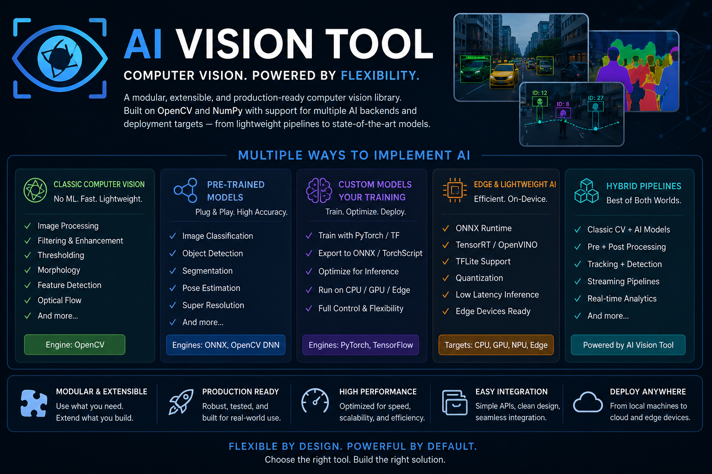

# AI Vision Tool
### Build Scalable, Real-Time Computer Vision Systems with OpenCV, AI Models, and Hybrid Pipelines

<p align="center">
  <a href="https://pypi.org/project/ai-vision-tool/"></a>
  <a href="https://pypi.org/project/ai-vision-tool/"></a>
  <a href="https://pypi.org/project/ai-vision-tool/"></a>
  <a href="https://pypi.org/project/ai-vision-tool/"></a>
</p>

<p align="center">
  
</p>

---

**AI Vision Tool** is a modular, extensible, and production-ready computer vision framework designed for modern AI-powered image and video processing workflows.

Built with a **lightweight OpenCV-first architecture**, it provides a unified ecosystem for preprocessing, augmentation, enhancement, visualization, streaming, capture pipelines, and AI model integration — enabling developers to rapidly build scalable vision applications ranging from classical computer vision systems to advanced deep learning pipelines.

```python
from ai_vision_tool.pipelines import AIVisionPipeline, PrebuiltPipelines
from ai_vision_tool.preprocessing import AutoOrient, LetterboxResize
from ai_vision_tool.detection import ObjectDetector
from ai_vision_tool.tracking import ByteTracker
from ai_vision_tool.visualization import BBoxRenderer

pipeline = (
    AIVisionPipeline()
    .add(AutoOrient())
    .add(LetterboxResize(width=640, height=640))
    .add(ObjectDetector(model_path="yolov8n.pt", conf_threshold=0.25))
    .add(ByteTracker(track_thresh=0.5))
    .add(BBoxRenderer(show_track_id=True))
)

result = pipeline.execute(initial_data={"frame": frame}, global_config={})
```

---

## Why AI Vision Tool?

| Concern | How it's solved |
|---------|----------------|
| **Complexity** | One unified `.run(data)` interface across 130+ components |
| **Dependencies** | Lightweight core (`numpy + opencv + pyyaml`), heavy deps are opt-in extras |
| **Scalability** | Async, parallel, and fan-out pipelines built-in |
| **Deployment** | CPU / CUDA / MPS / Edge — auto-detected at runtime |
| **Extensibility** | Subclass `AIVisionComponent`, plug in anywhere |

### Supported Implementation Strategies

```
Classical Computer Vision  →  Pre-trained AI Models  →  Custom Deep Learning
         ↕                           ↕                           ↕
   Edge AI Inference      ←→   Hybrid CV + AI Architectures   ←→  Cloud Streaming
```

The framework follows a **core + optional extensions** philosophy:

- **Lightweight core** — fast install, minimal footprint, no heavy deps
- **Optional AI runtimes** — ONNX, PyTorch, TensorFlow Lite via extras
- **Plugin-style integrations** — cloud storage, Kafka, WebSocket, Gradio dashboards
- **Edge and cloud deployment** — runs on Raspberry Pi through multi-GPU servers

> **Build once. Deploy anywhere. Scale from classical vision pipelines to state-of-the-art AI systems.**

---

## Table of Contents

- [Features](#features)
- [Installation](#installation)
- [Quickstart](#quickstart)
- [Preprocessing](#preprocessing)
- [Augmentation](#augmentation)
- [Pipeline](#pipeline)
- [Detection](#detection)
- [Tracking](#tracking)
- [Segmentation](#segmentation)
- [Enhancement](#enhancement)
- [I/O](#io)
- [Streaming](#streaming)
- [Visualization](#visualization)
- [Capture Components](#capture-components)
- [Utilities](#utilities)
- [Core](#core)
- [Configuration](#configuration)
- [Models](#models)
- [Prebuilt Pipelines](#prebuilt-pipelines)
- [Capture Templates](#capture-templates)
- [CLI Reference](#cli-reference)
- [Component Index](#component-index)
- [Output Structure](#output-structure)
- [Testing](#testing)
- [Build and Publish](#build-and-publish)

---

## Features

<details open>
<summary><strong>Pipelines & Architecture</strong></summary>

- Composable `AIVisionPipeline` — Chain of Responsibility, one interface for all components
- Async execution via `AsyncPipeline` (`asyncio` + `run_in_executor`)
- Parallel branches via `ParallelPipeline` and `FanOutPipeline` (`ThreadPoolExecutor`)
- Pipeline serialization to/from YAML/JSON via `PipelineSerializer`
- Prebuilt factory pipelines for detection, tracking, enhancement, augmentation

</details>

<details open>
<summary><strong>Preprocessing & Augmentation</strong></summary>

- **40+ preprocessing transforms** — geometry, intensity, color space, quality gates
- **70+ augmentation components** — geometric, weather, blur, noise, dropout, multi-image composition
- Batch processing: `component.run([img_a, img_b, img_c])` → list of results
- JSON augmentation profiles for CLI-driven training pipelines

</details>

<details open>
<summary><strong>Detection, Tracking & Segmentation</strong></summary>

- Object detection: YOLO (ultralytics) + ONNX with greedy NMS fallback
- Face detection: OpenCV Haar cascade or MediaPipe
- Keypoint/pose detection: MediaPipe 33-landmark or YOLO-pose
- OCR/text detection: EasyOCR, PaddleOCR
- Anomaly detection: statistical z-score, PatchCore (HOG + kNN), PCA
- Multi-object tracking: ByteTracker (two-stage), DeepSORT (HOG + cosine distance)
- Semantic, instance, and panoptic segmentation: ONNX / YOLO-seg / TorchScript
- SAM (Segment Anything Model): point, box, and auto-everything prompts
- Mask post-processing: erode / dilate / fill holes / largest-component / remove-small

</details>

<details open>
<summary><strong>Enhancement & Restoration</strong></summary>

- Super-resolution: `cv2.dnn_superres`, ONNX, bicubic fallback
- Denoising: Non-local means, bilateral, Gaussian, DnCNN-ONNX
- Deblurring: Wiener FFT, Richardson-Lucy, NAFNet-ONNX
- Low-light enhancement: CLAHE, gamma LUT, multi-scale Retinex, Zero-DCE
- Colorization: Zhang 2016 LAB-AB, pseudo-color, thermal

</details>

<details open>
<summary><strong>I/O, Streaming & Cloud</strong></summary>

- Flexible I/O: local images/video, webcam, RTSP, HTTP, AWS S3, GCS
- Dataset export: YOLO, COCO JSON, VOC XML
- Real-time streaming: RTSP client, WebSocket sink/source, Kafka producer/consumer
- Buffered queues with configurable drop policy and sliding window

</details>

<details open>
<summary><strong>Visualization & Dashboards</strong></summary>

- Live frame viewer with rolling FPS overlay (headless-safe)
- BBox renderer with consistent per-class colors and semi-transparent fill
- Heatmap renderer: detection density, anomaly maps, motion, attention
- Dashboard sink: Gradio or MJPEG HTTP fallback
- Annotated video export with JSON sidecar

</details>

<details open>
<summary><strong>Model Management</strong></summary>

- ONNX, TorchScript, TFLite runners as pipeline components
- Model registry with JSON cache and HuggingFace download support
- SHA256-verified downloader with progress callbacks
- Latency benchmarking: p50 / p95 / p99 + tracemalloc memory profiling

</details>

---

## Installation

### pip

```bash
pip install ai-vision-tool
```

With optional extras:

```bash
# ONNX inference
pip install "ai-vision-tool[onnx]"

# YOLO detection + MediaPipe face/pose
pip install "ai-vision-tool[detection]"

# Everything
pip install "ai-vision-tool[all]"
```

### uv

```bash
uv add ai-vision-tool
uv add "ai-vision-tool[detection]"
```

### Poetry

```bash
poetry add ai-vision-tool
poetry add "ai-vision-tool[detection]"
```

### Optional extras

The base install (`numpy + opencv-python + pyyaml`) has no heavy deps.
Optional extras install only the libraries each feature needs.

| Extra | Installs | Enables |
|-------|----------|---------|
| `onnx` | `onnxruntime>=1.18` | `ONNXModel`, ONNX-backed detectors and enhancement |
| `torch` | `torch>=2.3`, `torchvision>=0.18` | `TorchModel`, TorchScript inference |
| `tflite` | `tflite-runtime>=2.14` | `TFLiteModel` inference |
| `detection` | `ultralytics>=8.0`, `mediapipe>=0.10` | `ObjectDetector` (YOLO), `FaceDetector`/`KeypointDetector` (MediaPipe) |
| `segmentation` | `ultralytics>=8.0`, `segment-anything>=1.0`, `torch>=2.3` | `InstanceSegmenter` (YOLO-seg), `SAMSegmenter` |
| `tracking` | `onnxruntime>=1.18` | ONNX-backed ReID embeddings in `ReIDExtractor` |
| `websocket` | `websockets>=12.0` | `WebSocketSink`, `WebSocketSource` |
| `kafka` | `confluent-kafka>=2.3.0` | `KafkaSink`, `KafkaSource` |
| `streaming` | websocket + kafka | All real-time streaming components |
| `cloud` | `boto3>=1.34`, `google-cloud-storage>=2.16` | `S3Source`, `GCSSource` |
| `api` | `fastapi>=0.115`, `uvicorn>=0.30` | FastAPI REST server |
| `all` | all of the above | Full feature set |

### Development Setup

```bash
git clone https://github.com/anurupborah2001/ai-vision-tools.git
cd ai-vision-tools

# Install all dev dependencies
make install-dev

# Install pre-commit hooks (commit-msg via commitizen, pre-push, pre-commit)
make hooks
```

Or without `make`:

```bash
uv sync --dev
uv run pre-commit install
uv run pre-commit install --hook-type commit-msg
uv run pre-commit install --hook-type pre-push
```

#### Commit messages

Commits are validated by [commitizen](https://github.com/commitizen-tools/commitizen)
at the `commit-msg` stage. Use the interactive prompt to build a valid commit:

```bash
uv run cz commit
```

Or write manually following [Conventional Commits](https://www.conventionalcommits.org/):

```
feat: add fog augmentation pipeline stage
fix: clamp crop bounds to prevent negative slice indices
docs: update CLI usage examples
test: add coverage for weather augmentation components
```

| Prefix | Version bump |
|--------|-------------|
| `fix:`, `perf:`, `refactor:` | patch |
| `feat:` | minor |
| `BREAKING CHANGE:` / `feat!:` | major |

#### Common development tasks

```bash
make lint        # ruff + isort + black (check only)
make format      # auto-fix with ruff + isort + black
make test        # run full test suite
make test-fast   # stop on first failure
make bump        # bump version from commits (commitizen)
make changelog   # regenerate CHANGELOG.md
make build       # build sdist + wheel into dist/
make help        # list all targets
```

---

## Quickstart

```python
import cv2
from ai_vision_tool.pipelines import AIVisionPipeline
from ai_vision_tool.preprocessing import AutoOrient, AutoAdjustContrast
from ai_vision_tool.augmentation import Flip, GaussianBlur

image = cv2.imread("images/github/sample.jpg")

pipeline = AIVisionPipeline()
pipeline.add(AutoOrient(rotation=90))
pipeline.add(AutoAdjustContrast(method="adaptive_equalization", clip_limit=2.0))
pipeline.add(Flip(horizontal=True))
pipeline.add(GaussianBlur(kernel_size=5, sigma_x=1.0))

result = pipeline.execute(initial_data={"frame": image}, global_config={})
print(result["frame"].shape)  # (height, width, 3)
```

You can also import any component directly from the top-level namespace:

```python
from ai_vision_tool import AutoOrient, Flip, GaussianBlur, AIVisionPipeline
```

All imports use lazy loading — only modules you actually use are loaded.

---

## Preprocessing

Preprocessing transforms prepare raw images for downstream model inference, quality gating,
or dataset ingestion. Every component accepts either a NumPy array or a payload dictionary
`{"frame": ndarray, ...}`.

```python
import cv2
image = cv2.imread("images/github/sample.jpg")
```

### Import Path

```python
from ai_vision_tool.preprocessing import (
    AutoOrient,
    AutoAdjustContrast,
    Resize,
    LetterboxResize,
    CenterCrop,
    PadToSquare,
    Normalize,
    Standardize,
    RescalePixels,
    ConvertColorSpace,
    BGRToRGB,
    RGBToBGR,
    CLAHE,
    HistogramEqualization,
    GammaCorrection,
    WhiteBalance,
    Denoise,
    Sharpen,
    Deblur,
    RemoveBackground,
    Threshold,
    AdaptiveThreshold,
    EdgeDetection,
    ContourExtraction,
    PerspectiveCorrection,
    Deskew,
    AutoCrop,
    FaceAlign,
    ObjectCrop,
    BoundingBoxClamp,
    BoundingBoxNormalize,
    MaskResize,
    ImageQualityCheck,
    BlurDetection,
    BrightnessCheck,
    DuplicateImageCheck,
    CorruptImageCheck,
    AspectRatioFilter,
    MinSizeFilter,
    MaxSizeFilter,
)
```

---

### Geometry

**`AutoOrient`** — Correct EXIF orientation metadata or apply an explicit rotation and flip.

```python
from ai_vision_tool.preprocessing import AutoOrient

result = AutoOrient(rotation=90).run(image)
result = AutoOrient(flip_horizontal=True).run(image)
result = AutoOrient(use_exif=True, exif_key="exif_orientation").run(
    {"frame": image, "exif_orientation": 6}
)
```

**`Resize`** — Resize to an exact target size.

```python
from ai_vision_tool.preprocessing import Resize

result = Resize(width=640, height=640).run(image)
```

**`LetterboxResize`** — Resize preserving aspect ratio, padding the shorter axis.

```python
from ai_vision_tool.preprocessing import LetterboxResize

result = LetterboxResize(width=640, height=640, pad_value=(114, 114, 114)).run(image)
```

**`CenterCrop`** — Crop the centre region.

```python
from ai_vision_tool.preprocessing import CenterCrop

result = CenterCrop(width=224, height=224).run(image)
```

**`PadToSquare`** — Pad a rectangular image to a square canvas.

```python
from ai_vision_tool.preprocessing import PadToSquare

result = PadToSquare(pad_value=(0, 0, 0)).run(image)
```

**`PerspectiveCorrection`** — Rectify a quadrilateral document or planar surface.

```python
import numpy as np
from ai_vision_tool.preprocessing import PerspectiveCorrection

source_points = np.float32([[30, 20], [310, 10], [320, 240], [20, 250]])
result = PerspectiveCorrection(source_points=source_points, output_size=(300, 200)).run(image)
```

**`Deskew`** — Rotate a document back to a levelled angle.

```python
from ai_vision_tool.preprocessing import Deskew

result = Deskew().run(image)
```

**`AutoCrop`** — Trim empty or near-black borders.

```python
from ai_vision_tool.preprocessing import AutoCrop

result = AutoCrop(threshold=10, padding=4).run(image)
```

**`FaceAlign`** — Align a face using eye landmark coordinates from a payload dict.

```python
from ai_vision_tool.preprocessing import FaceAlign

payload = {"frame": image, "metadata": {"left_eye": (40, 50), "right_eye": (90, 50)}}
result = FaceAlign(output_size=(112, 112)).run(payload)
```

**`ObjectCrop`** — Crop the region described by bounding boxes.

```python
from ai_vision_tool.preprocessing import ObjectCrop

payload = {"frame": image, "bboxes": [(10, 20, 120, 80)]}
result = ObjectCrop().run(payload)
```

**`BoundingBoxClamp`** — Clamp bounding boxes that extend outside image boundaries.

```python
from ai_vision_tool.preprocessing import BoundingBoxClamp

payload = {"frame": image, "bboxes": [(-5, -5, 80, 90)]}
result = BoundingBoxClamp().run(payload)
```

**`BoundingBoxNormalize`** — Normalise absolute pixel bounding boxes to relative coordinates.

```python
from ai_vision_tool.preprocessing import BoundingBoxNormalize

payload = {"frame": image, "bboxes": [(10, 20, 120, 80)]}
result = BoundingBoxNormalize().run(payload)
```

**`MaskResize`** — Resize a payload mask to match a target spatial size.

```python
import numpy as np
from ai_vision_tool.preprocessing import MaskResize

mask = np.zeros((image.shape[0], image.shape[1]), dtype=np.uint8)
payload = {"frame": image, "mask": mask}
result = MaskResize(width=640, height=640).run(payload)
```

---

### Intensity and Color

**`AutoAdjustContrast`** — Adaptive equalization, histogram equalization, or contrast stretching.

```python
from ai_vision_tool.preprocessing import AutoAdjustContrast

result = AutoAdjustContrast(method="adaptive_equalization", clip_limit=2.0).run(image)
result = AutoAdjustContrast(method="histogram_equalization").run(image)
result = AutoAdjustContrast(
    method="contrast_stretching", lower_percentile=2.0, upper_percentile=98.0
).run(image)
```

**`Normalize`** — Map pixel values into [0, 1].

```python
from ai_vision_tool.preprocessing import Normalize

result = Normalize().run(image)
```

**`Standardize`** — z-score standardisation per channel.

```python
from ai_vision_tool.preprocessing import Standardize

result = Standardize(per_channel=True).run(image)
```

**`CLAHE`** — Contrast-Limited Adaptive Histogram Equalisation.

```python
from ai_vision_tool.preprocessing import CLAHE

result = CLAHE(clip_limit=2.0, tile_grid_size=(8, 8)).run(image)
```

**`GammaCorrection`** — Gamma-based exposure tuning.

```python
from ai_vision_tool.preprocessing import GammaCorrection

result = GammaCorrection(gamma=1.4).run(image)  # brighten
result = GammaCorrection(gamma=0.7).run(image)  # darken
```

**`WhiteBalance`** — Correct per-channel colour casts.

```python
from ai_vision_tool.preprocessing import WhiteBalance

result = WhiteBalance(method="gray_world").run(image)
```

**`EdgeDetection`** — Extract edges via Canny, Sobel, or Laplacian.

```python
from ai_vision_tool.preprocessing import EdgeDetection

result = EdgeDetection(method="canny", threshold1=100, threshold2=200).run(image)
```

---

### Quality Checks

**`ImageQualityCheck`** — Compute blur and brightness quality flags.

```python
from ai_vision_tool.preprocessing import ImageQualityCheck

result = ImageQualityCheck().run({"frame": image})
# result["is_blurry"], result["brightness"]
```

**`BlurDetection`** — Flag frames below a Laplacian variance threshold.

```python
from ai_vision_tool.preprocessing import BlurDetection

result = BlurDetection().run({"frame": image})
```

**`MinSizeFilter`** / **`MaxSizeFilter`** — Enforce pixel dimension bounds.

```python
from ai_vision_tool.preprocessing import MinSizeFilter, MaxSizeFilter

result = MinSizeFilter(min_width=320, min_height=320).run({"frame": image})
result = MaxSizeFilter(max_width=2048, max_height=2048).run({"frame": image})
```

---

## Augmentation

Augmentation components apply stochastic or deterministic transforms for training-time
variation. Every component exposes the same `.run(input)` interface.

```python
import cv2
image = cv2.imread("images/github/sample.jpg")
```

### Import Path

```python
from ai_vision_tool.augmentation import (
    Flip, Rotate90, Crop, Rotation, Shear, Translate,
    RandomResize, RandomScale, RandomCrop, RandomResizedCrop, RandomPadding,
    AffineTransform, PerspectiveTransform, ElasticTransform,
    GridDistortion, OpticalDistortion,
    Brightness, Exposure, Hue, Saturation, Greyscale,
    ColorJitter, RandomGamma, RandomBrightnessContrast,
    RandomShadow, RandomSunFlare, RandomFog, RandomRain, RandomSnow,
    ChannelShuffle, RGBShift, HSVShift, ToSepia, InvertImage,
    Blur, GaussianBlur, MedianBlur, GlassBlur, DefocusBlur,
    ZoomBlur, MotionBlur, CameraGain,
    Emboss, Posterize, Solarize, Equalize,
    CompressionArtifacts, JPEGCompression, Downscale, Superpixel,
    Noise, ISONoise, MultiplicativeNoise, SaltPepperNoise,
    CoarseDropout, GridDropout, RandomErasing, PixelDropout, MaskDropout,
    Cutout, Mosaic, Mosaic9, MixUp, CutMix,
    CopyPaste, ObjectPaste, RandomOcclusion, BoundingBoxJitter,
)
```

### Geometric and Spatial

```python
from ai_vision_tool.augmentation import Flip, Rotate90, Rotation, Shear

result = Flip(horizontal=True).run(image)
result = Rotate90(k=1).run(image)
result = Rotation(angle=12.0, expand=False, border_mode="constant").run(image)
result = Shear(shear_x=0.15).run(image)
```

**`RandomResizedCrop`** — Random crop + resize (equivalent to torchvision).

```python
from ai_vision_tool.augmentation import RandomResizedCrop

result = RandomResizedCrop(
    output_width=224, output_height=224, scale_min=0.08, scale_max=1.0
).run(image)
```

**`AffineTransform`** — Combined rotate/scale/translate/shear in one pass.

```python
from ai_vision_tool.augmentation import AffineTransform

result = AffineTransform(angle=8.0, scale=1.0, translate_x=10.0, shear_x=0.05).run(image)
```

**`ElasticTransform`** / **`GridDistortion`** / **`OpticalDistortion`** — Spatial warping.

```python
from ai_vision_tool.augmentation import ElasticTransform, GridDistortion, OpticalDistortion

result = ElasticTransform(alpha=3.0, sigma=1.0).run(image)
result = GridDistortion(num_steps=5, distort_limit=0.2).run(image)
result = OpticalDistortion(k=0.00001).run(image)
```

### Lighting, Color, and Weather

```python
from ai_vision_tool.augmentation import (
    ColorJitter, RandomShadow, RandomFog, RandomRain
)

result = ColorJitter(brightness=0.2, contrast=0.2, saturation=0.2, hue=8).run(image)
result = RandomShadow(shadow_dimension=0.5, intensity=0.5).run(image)
result = RandomFog(alpha=0.2).run(image)
result = RandomRain(drops=40, drop_length=12, intensity=0.25).run(image)
```

### Blur, Compression, and Texture

```python
from ai_vision_tool.augmentation import (
    GaussianBlur, MotionBlur, DefocusBlur, JPEGCompression, Superpixel
)

result = GaussianBlur(kernel_size=5, sigma_x=1.0).run(image)
result = MotionBlur(kernel_size=11, angle=25.0).run(image)
result = DefocusBlur(radius=5).run(image)
result = JPEGCompression(quality=40).run(image)
result = Superpixel(region_size=10).run(image)
```

### Noise and Dropout

```python
from ai_vision_tool.augmentation import (
    Noise, ISONoise, CoarseDropout, GridDropout
)

result = Noise(mode="gaussian", mean=0.0, stddev=8.0).run(image)
result = ISONoise(color_shift=0.01, intensity=0.5).run(image)
result = CoarseDropout(holes=8, max_height=8, max_width=8).run(image)
result = GridDropout(ratio=0.5, unit_size=8).run(image)
```

### Multi-Image and Annotation-Aware

```python
import cv2
from ai_vision_tool.augmentation import MixUp, CutMix, Mosaic, BoundingBoxJitter

image_b = cv2.imread("images/github/sample.jpg")

result = MixUp(alpha=0.5).run({"frame": image, "mix_image": image_b})
result = CutMix(alpha=0.5).run({"frame": image, "mix_image": image_b})

tiles = [image] * 3
result = Mosaic(output_size=(640, 640), mosaic_images=tiles).run(image)

payload = {"frame": image, "bboxes": [(10, 10, 100, 60)]}
result = BoundingBoxJitter(x_jitter=0.05, y_jitter=0.05, size_jitter=0.1).run(payload)
```

### Batch Processing

```python
from ai_vision_tool.augmentation import Flip

results = Flip(horizontal=True).run([image, image, image])  # list → list
```

### Augmentation Profile (JSON)

```json
[
  {"name": "RandomResizedCrop", "params": {"output_width": 256, "output_height": 256}},
  {"name": "ColorJitter", "params": {"brightness": 0.2, "contrast": 0.2}},
  {"name": "GaussianBlur", "params": {"kernel_size": 5, "sigma_x": 1.0}}
]
```

```bash
ai-vision-tool --augmentation-config examples/augmentation_profile.json
```

---

## Pipeline

`AIVisionPipeline` implements a Chain of Responsibility pattern.

```python
import cv2
from ai_vision_tool.pipelines import AIVisionPipeline
from ai_vision_tool.preprocessing import AutoOrient, Resize
from ai_vision_tool.augmentation import Flip, ColorJitter
from ai_vision_tool.visualization import FrameAnnotator
from ai_vision_tool.capture import MotionDetector

image = cv2.imread("images/github/sample.jpg")

pipeline = (
    AIVisionPipeline()
    .add(AutoOrient(rotation=90))
    .add(Resize(width=640, height=640))
    .add(Flip(horizontal=True))
    .add(ColorJitter(brightness=0.15, contrast=0.15, saturation=0.15, hue=5))
    .add(MotionDetector())
    .add(FrameAnnotator())
)

result = pipeline.execute(
    initial_data={"frame": image, "annotations": []},
    global_config={"min_area": 800},
)
output_frame = result["frame"]
```

---

## Detection

Detection components output `data["bboxes"]` (list of dicts with `x1/y1/x2/y2/label/conf`).

```python
import cv2
image = cv2.imread("images/github/sample.jpg")
```

### ObjectDetector

YOLO (ultralytics) or ONNX backend with greedy NMS fallback.

```python
from ai_vision_tool.detection import ObjectDetector

detector = ObjectDetector(
    model_path="yolov8n.pt",   # or "model.onnx"
    conf_threshold=0.25,
    iou_threshold=0.45,
    backend="yolo",            # "yolo" | "onnx"
    class_names=None,          # auto-loaded from ultralytics
)
result = detector.run({"frame": image})
print(result["bboxes"])        # [{"x1": ..., "y1": ..., "x2": ..., "y2": ..., "label": ..., "conf": ...}]
print(result["detection_count"])
```

### FaceDetector

OpenCV Haar cascade (bundled with OpenCV) or MediaPipe.

```python
from ai_vision_tool.detection import FaceDetector

detector = FaceDetector(
    backend="opencv",          # "opencv" | "mediapipe"
    conf_threshold=0.5,
    min_face_size=20,
)
result = detector.run({"frame": image})
print(result["faces"])         # same schema as bboxes + "face_id" key
print(result["bboxes"])        # unified bbox list
```

### KeypointDetector

MediaPipe 33-landmark pose with pixel coordinates, or YOLO-pose.

```python
from ai_vision_tool.detection import KeypointDetector

detector = KeypointDetector(
    backend="mediapipe",       # "mediapipe" | "yolo_pose"
    model_complexity=1,
)
result = detector.run({"frame": image})
print(result["poses"])         # list of {"keypoints": [{x, y, z, visibility, name}, ...]}
```

### TextDetector

EasyOCR, PaddleOCR, or EAST placeholder.

```python
from ai_vision_tool.detection import TextDetector

detector = TextDetector(
    backend="easyocr",         # "easyocr" | "paddleocr" | "east"
    conf_threshold=0.5,
    languages=["en"],
)
result = detector.run({"frame": image})
print(result["text_regions"])  # [{"x1", "y1", "x2", "y2", "text", "conf"}]
```

### AnomalyDetector

Statistical z-score histogram, PatchCore (HOG + NearestNeighbors), or PCA approximation.

```python
from ai_vision_tool.detection import AnomalyDetector

detector = AnomalyDetector(
    method="statistical",      # "statistical" | "patchcore" | "pca"
    window=30,                 # warmup frames for baseline
    threshold=2.0,
)
# Feed frames sequentially — detector builds baseline during warmup
result = detector.run({"frame": image})
print(result["anomaly_score"])
print(result["is_anomaly"])    # bool
print(result["anomaly_map"])   # spatial heatmap (numpy array)
```

---

## Tracking

Tracking components extend detection output with persistent `track_id` per object.
Input: `data["bboxes"]` from a detector. Output: `data["tracks"]`.

### ByteTracker

State-of-the-art two-stage association: high-confidence detections first, then
low-confidence detections vs. unmatched tracks (Zhang et al. 2022).

```python
from ai_vision_tool.detection import ObjectDetector
from ai_vision_tool.tracking import ByteTracker
from ai_vision_tool.pipelines import AIVisionPipeline

pipeline = (
    AIVisionPipeline()
    .add(ObjectDetector(model_path="yolov8n.pt", conf_threshold=0.25))
    .add(ByteTracker(
        track_thresh=0.5,
        track_buffer=30,       # frames to keep a lost track
        match_thresh=0.8,
    ))
)

result = pipeline.execute(initial_data={"frame": image}, global_config={})
for track in result["tracks"]:
    print(track["track_id"], track["label"], track["x1"], track["y1"])
```

### DeepSORTTracker

HOG-based re-identification embedding with cosine distance. Drop-in replacement for
ByteTracker; use when identity consistency across long occlusions matters.

```python
from ai_vision_tool.tracking import DeepSORTTracker

tracker = DeepSORTTracker(
    max_age=30,
    min_hits=3,
    iou_threshold=0.3,
    embedding_method="hog",   # "hog" | "osnet_onnx"
)
result = tracker.run({"frame": image, "bboxes": [...]})
print(result["tracks"])
```

### ReIDExtractor

Extract appearance embeddings for gallery-matching workflows.

```python
from ai_vision_tool.tracking import ReIDExtractor

extractor = ReIDExtractor(method="hog", embedding_dim=128)
result = extractor.run({"frame": image, "bboxes": [...]})
print(result["embeddings"])  # list of float arrays, one per bbox
```

### TrackManager

Low-level track lifecycle management. Used internally by ByteTracker and DeepSORTTracker
but accessible directly for custom tracking logic.

```python
from ai_vision_tool.tracking import TrackManager

tm = TrackManager(max_age=30, min_hits=3, iou_threshold=0.3)
tracks = tm.update(bboxes_list, frame_id=42)
```

### KalmanFilter

7-state (cx, cy, s, r, vx, vy, vs) Kalman filter used by both built-in trackers.

```python
from ai_vision_tool.tracking import KalmanFilter

kf = KalmanFilter()
mean, cov = kf.initiate([x1, y1, x2, y2])
mean, cov = kf.predict(mean, cov)
mean, cov = kf.update(mean, cov, [x1, y1, x2, y2])
```

---

## Segmentation

Segmentation components produce pixel-level masks. All follow the same component interface.

### SemanticSegmenter

ONNX, OpenCV DNN, or TorchScript backend. Defaults to VOC-21 class names.

```python
from ai_vision_tool.segmentation import SemanticSegmenter

segmenter = SemanticSegmenter(
    model_path="deeplabv3.onnx",
    backend="onnx",           # "onnx" | "opencv_dnn" | "torch"
    num_classes=21,
    input_size=(513, 513),
)
result = segmenter.run({"frame": image})
print(result["seg_map"])      # (H, W) class index array
print(result["seg_overlay"])  # colorized overlay on original frame
print(result["masks"])        # list of per-class binary masks
```

### InstanceSegmenter

YOLO-seg mask output resized to original frame size.

```python
from ai_vision_tool.segmentation import InstanceSegmenter

segmenter = InstanceSegmenter(
    model_path="yolov8n-seg.pt",
    backend="yolo",
    conf_threshold=0.25,
)
result = segmenter.run({"frame": image})
print(result["masks"])          # list of binary masks
print(result["bboxes"])         # aligned with masks
print(result["instance_overlay"])
```

### PanopticSegmenter

Separates stuff (background) and thing (object) classes.

```python
from ai_vision_tool.segmentation import PanopticSegmenter

segmenter = PanopticSegmenter(model_path="panoptic.onnx")
result = segmenter.run({"frame": image})
print(result["panoptic_map"])   # (H, W) instance-class encoded
print(result["stuff_mask"])
print(result["thing_mask"])
```

### SAMSegmenter

Segment Anything Model — point, box, and auto-everything prompts.

```python
from ai_vision_tool.segmentation import SAMSegmenter

# Point prompt
segmenter = SAMSegmenter(
    model_path="sam_vit_b.pth",
    model_type="vit_b",
    mode="point",
    device="auto",
)
result = segmenter.run({"frame": image, "prompt_points": [(320, 240)], "prompt_labels": [1]})
print(result["masks"])          # list of binary masks
print(result["iou_scores"])

# Auto-everything (no prompts)
segmenter = SAMSegmenter(model_path="sam_vit_b.pth", mode="auto")
result = segmenter.run({"frame": image})
print(result["masks"])          # all detected segments
```

### MaskPostProcessor

Morphological cleanup of segmentation masks.

```python
from ai_vision_tool.segmentation import MaskPostProcessor

processor = MaskPostProcessor(
    operations=["erode", "dilate", "fill_holes", "remove_small", "largest_only"],
    kernel_size=5,
)
result = processor.run({"frame": image, "masks": [binary_mask]})
print(result["masks"])          # cleaned masks
print(result["polygons"])       # polygon contours per mask
```

---

## Enhancement

Enhancement components restore or improve degraded images. All use the same component
interface and fall back to pure NumPy/OpenCV if heavy deps are unavailable.

### SuperResolution

2× or 4× upscaling. Uses `cv2.dnn_superres` if available, then ONNX, then bicubic.

```python
from ai_vision_tool.enhancement import SuperResolution

sr = SuperResolution(
    scale=2,
    backend="auto",           # "auto" | "opencv" | "onnx" | "bicubic"
    model_path=None,          # optional ONNX or OpenCV SR model
)
result = sr.run({"frame": image})
print(result["frame"].shape)   # (H*2, W*2, 3)
print(result["sr_scale"])      # 2
print(result["sr_backend"])    # "bicubic" / "opencv" / "onnx"
```

### Denoiser

Non-local means, bilateral filter, Gaussian, median, or DnCNN-ONNX.

```python
from ai_vision_tool.enhancement import Denoiser

result = Denoiser(method="nlmeans", strength=10.0).run({"frame": image})
result = Denoiser(method="bilateral", strength=9.0).run({"frame": image})
result = Denoiser(method="gaussian", strength=3.0).run({"frame": image})
# DnCNN-ONNX
result = Denoiser(method="dncnn", model_path="dncnn.onnx").run({"frame": image})
print(result["denoise_method"])
```

### Deblurrer

Wiener deconvolution (FFT), Richardson-Lucy iterative, unsharp mask, or NAFNet-ONNX.

```python
from ai_vision_tool.enhancement import Deblurrer

result = Deblurrer(method="wiener", kernel_size=5).run({"frame": image})
result = Deblurrer(method="richardson_lucy", kernel_size=5, iterations=10).run({"frame": image})
result = Deblurrer(method="unsharp", strength=1.0).run({"frame": image})
result = Deblurrer(method="nafnet", model_path="nafnet.onnx").run({"frame": image})
```

### LowLightEnhancer

CLAHE on LAB L-channel, gamma LUT, histogram stretch, single/multi-scale Retinex,
Zero-DCE brightness curve approximation, or ONNX model.

```python
from ai_vision_tool.enhancement import LowLightEnhancer

result = LowLightEnhancer(method="clahe", clip_limit=3.0).run({"frame": image})
result = LowLightEnhancer(method="gamma", gamma=0.5).run({"frame": image})
result = LowLightEnhancer(method="msr").run({"frame": image})   # multi-scale Retinex
result = LowLightEnhancer(method="zero_dce").run({"frame": image})
result = LowLightEnhancer(method="onnx", model_path="llnet.onnx").run({"frame": image})
```

### Colorizer

Zhang 2016 LAB-AB network colorization, pseudo-color (VIRIDIS), thermal (JET), or ONNX.

```python
from ai_vision_tool.enhancement import Colorizer

result = Colorizer(method="opencv_dnn", model_path="colorization.caffemodel").run({"frame": gray_image})
result = Colorizer(method="pseudo_color").run({"frame": gray_image})
result = Colorizer(method="thermal").run({"frame": gray_image})
print(result["is_grayscale_input"])   # True if input was single-channel
```

---

## I/O

I/O components read images, videos, and cloud blobs, or export annotated datasets.

### ImageReader / ImageWriter

```python
from ai_vision_tool.io import ImageReader, ImageWriter

# Read a single image
reader = ImageReader(path="image.jpg", color_mode="bgr")  # "bgr" | "rgb" | "gray"
result = reader.run({})
image = result["frame"]

# Write frames — {index}, {timestamp}, {label} tokens in filename
writer = ImageWriter(
    output_dir="output/frames",
    filename_pattern="{index:06d}.jpg",
    quality=95,
)
writer.run({"frame": image})
writer.cleanup()
```

### VideoReader / VideoWriter

```python
from ai_vision_tool.io import VideoReader, VideoWriter

# Stream frames from a video file
reader = VideoReader("video.mp4", start_frame=0, step=1)
for payload in reader:
    if payload.get("eof"):
        break
    frame = payload["frame"]

# Write annotated frames to video
writer = VideoWriter(output_path="out.mp4", fps=30.0, codec="mp4v")
writer.run({"frame": frame})
writer.cleanup()
```

### CameraSource

Live webcam, RTSP, or HTTP stream reader.

```python
from ai_vision_tool.io import CameraSource

cam = CameraSource(
    source=0,                  # 0 = webcam, "rtsp://..." = RTSP, "http://..." = HTTP
    width=1280,
    height=720,
    fps=30.0,
    buffer_size=1,
)
cam.setup({})

payload = {"frame": None}
result = cam.run(payload)
frame = result["frame"]
print(result["fps_actual"])
cam.cleanup()
```

### S3Source / GCSSource

Stream images from cloud storage as pipeline inputs.

```python
from ai_vision_tool.integrations.cloud import S3Source

source = S3Source(
    bucket="my-bucket",
    prefix="images/train/",
    extensions=(".jpg", ".png"),
    aws_region="ap-southeast-1",
)
source.setup({})
result = source.run({})         # reads next image from bucket
frame = result["frame"]
print(result["s3_key"])
```

```python
from ai_vision_tool.integrations.cloud import GCSSource

source = GCSSource(
    bucket="my-gcs-bucket",
    prefix="frames/",
    credentials_path="/path/to/sa.json",  # None = use ADC
)
result = source.run({})
```

### DatasetExporter

Export detections as YOLO txt, COCO JSON, or VOC XML.

```python
from ai_vision_tool.io import DatasetExporter

exporter = DatasetExporter(
    output_dir="dataset/",
    format="yolo",             # "yolo" | "coco" | "voc"
    split="train",
    class_names=["cat", "dog"],
)
exporter.run({
    "frame": image,
    "bboxes": [{"x1": 10, "y1": 20, "x2": 120, "y2": 80, "label": "cat", "conf": 0.9}],
})
exporter.cleanup()             # flushes COCO JSON / VOC XML to disk
```

---

## Streaming

Streaming components connect real-time sources and sinks to pipelines.

### FrameStream / DirectoryStream

Unified iterator over webcam index, video path, list of paths, or image directory.

```python
from ai_vision_tool.streaming import FrameStream, DirectoryStream

# Iterate a video
with FrameStream("video.mp4", max_frames=100) as stream:
    for payload in stream:
        frame = payload["frame"]

# Iterate sorted images from a directory
for payload in DirectoryStream("data/frames/", extensions=(".jpg", ".png")):
    frame = payload["frame"]
```

### RTSPClient

Background-threaded RTSP reader with auto-reconnect.

```python
from ai_vision_tool.streaming import RTSPClient

client = RTSPClient(
    url="rtsp://192.168.1.10:554/stream",
    reconnect=True,
    reconnect_delay=2.0,
    max_retries=3,
)
client.setup({})
result = client.run({})        # returns latest buffered frame
frame = result["frame"]
client.cleanup()
```

### WebSocketSink / WebSocketSource

Broadcast frames as base64 JPEG over WebSocket. Falls back to MJPEG HTTP when
`websockets` is not installed.

```python
from ai_vision_tool.integrations.streaming import WebSocketSink

sink = WebSocketSink(host="0.0.0.0", port=8765, quality=80)
sink.setup({})

sink.run({"frame": frame})    # broadcast to all connected clients
sink.cleanup()
```

```python
from ai_vision_tool.integrations.streaming import WebSocketSource

source = WebSocketSource(url="ws://localhost:8765")
source.setup({})
result = source.run({})
frame = result["frame"]
```

### KafkaSource / KafkaSink

Stream frames as base64-JPEG JSON messages through Kafka. Requires the `kafka` extra
(`pip install "ai-vision-tool[kafka]"`).

```python
from ai_vision_tool.integrations.streaming import KafkaSink, KafkaSource

sink = KafkaSink(bootstrap_servers="localhost:9092", topic="vision_frames", quality=80)
sink.setup({})
sink.run({"frame": frame})

source = KafkaSource(
    bootstrap_servers="localhost:9092",
    topic="vision_frames",
    group_id="ai_vision",
)
source.setup({})
result = source.run({})
frame = result["frame"]
```

### BufferedStream / SlidingWindowBuffer

Decouple producer and consumer speeds with a frame buffer.

```python
from ai_vision_tool.streaming import BufferedStream, SlidingWindowBuffer

# Buffer with "oldest" drop policy when full
buf = BufferedStream(buffer_size=30, drop_policy="oldest", emit_rate=None)
buf.run({"frame": frame})      # push frame
result = buf.run({})           # pop frame

# Sliding window — yields batches of `window` frames with optional overlap
window = SlidingWindowBuffer(window=16, overlap=8)
window.push(frame)
if window.ready():
    batch = window.get()       # list of 16 frames
```

---

## Visualization

Visualization components render annotations, serve dashboards, and export annotated video.

### FrameViewer

Display frames in a cv2 window with rolling FPS. Sets `data["stop"] = True` on `q`.

```python
from ai_vision_tool.visualization import FrameViewer

viewer = FrameViewer(window_name="Preview", fps_window=30)
viewer.setup({})

for payload in FrameStream("video.mp4"):
    result = viewer.run(payload)
    if result.get("stop"):
        break
viewer.cleanup()
```

### BBoxRenderer

Render bounding boxes with consistent per-class colors, optional semi-transparent fill,
and label/confidence/track-id text.

```python
from ai_vision_tool.visualization import BBoxRenderer

renderer = BBoxRenderer(
    thickness=2,
    font_scale=0.5,
    show_conf=True,
    show_label=True,
    show_track_id=True,
    alpha=0.25,               # semi-transparent fill; 0 = no fill
)
result = renderer.run({
    "frame": image,
    "bboxes": [{"x1": 10, "y1": 20, "x2": 200, "y2": 150, "label": "person", "conf": 0.87}],
})
output = result["rendered_frame"]
```

### HeatmapRenderer

Accumulate and overlay spatial heatmaps from detections, anomaly maps, attention, or
optical flow.

```python
from ai_vision_tool.visualization import HeatmapRenderer
import cv2

renderer = HeatmapRenderer(
    source="detections",      # "detections" | "anomaly_map" | "attention" | "motion"
    colormap=cv2.COLORMAP_JET,
    alpha=0.5,
    accumulate=True,           # keep cumulative density
    decay=0.95,
)
result = renderer.run({"frame": image, "bboxes": [...]})
print(result["heatmap"])          # raw density float array
print(result["heatmap_overlay"])  # blended on original frame
```

### DashboardSink

Serve a live stream dashboard. Uses Gradio if installed; falls back to MJPEG HTTP.

```python
from ai_vision_tool.visualization import DashboardSink

sink = DashboardSink(host="0.0.0.0", port=7860, quality=80, title="Vision Dashboard")
sink.setup({})
# Opens http://0.0.0.0:7860/ — update by pushing frames in your loop
sink.run({"frame": frame})
```

### VideoAnnotationExporter

Write an annotated output video with optional JSON sidecar containing per-frame bbox data.

```python
from ai_vision_tool.visualization import VideoAnnotationExporter

exporter = VideoAnnotationExporter(
    output_path="output/annotated.mp4",
    fps=30.0,
    codec="mp4v",
    burn_annotations=True,    # render bboxes/tracks onto frames
    export_json=True,         # write annotated.mp4 + annotated_annotations.json
)
exporter.setup({})

for payload in FrameStream("video.mp4"):
    # payload["bboxes"] or payload["tracks"] added by upstream detector/tracker
    exporter.run(payload)

exporter.cleanup()            # flushes video + JSON
```

---

## Capture Components

Stateful capture and annotation helpers. Import from their domain modules.

```python
import cv2
image = cv2.imread("images/github/sample.jpg")
```

### Frame Processors

**`FrameEnhancer`** — Brightness, contrast, sharpening, denoising in a single pass.

```python
from ai_vision_tool.enhancement import FrameEnhancer

result = FrameEnhancer().run(
    {"frame": image},
    {"brightness": 10, "contrast": 1.15, "sharpen": True, "denoise": False},
)
```

**`MotionDetector`** — Detect motion regions using background subtraction.

```python
from ai_vision_tool.capture import MotionDetector

result = MotionDetector().run({"frame": image}, {"min_area": 800, "draw_motion": True})
print(result["motion_boxes"])
```

**`FrameAnnotator`** — Render payload-driven annotations (text, boxes, lines).

```python
from ai_vision_tool.visualization import FrameAnnotator

result = FrameAnnotator().run(
    {"frame": image, "annotations": [{"type": "text", "text": "Demo", "pos": (20, 30)}]},
    {},
)
```

### Capture Helpers

```python
from ai_vision_tool.capture import PictureTaker, BurstPictureTaker, VideoTaker, FrameGrabber

PictureTaker().run(None, {"imgdir": "output/stills", "camera_id": 0})
BurstPictureTaker(burst_count=5, interval_seconds=0.2)
VideoTaker().run(None, {"viddir": "output/videos", "fps": 30.0})
FrameGrabber().run("video.mp4", {"output_folder": "output/frames", "skip_frames": 90})
```

### Dataset and Export

```python
from ai_vision_tool.io import DatasetCollector, ImageExporter
from ai_vision_tool.capture import TimeLapseCapture

DatasetCollector().run(
    {"frame": image},
    {"save_sample": True, "output_dir": "output/dataset", "label": "forklift"},
)
TimeLapseCapture(output_dir="output/timelapse", interval_seconds=5).run({"frame": image}, {})
ImageExporter(output_dir="output/exports").run({"frame": image}, {"export_gray": True})
```

### Auto-Labeling

```python
from ai_vision_tool.integrations.labeling import DarknetAutoLabeler, TensorFlowAutoLabeler

DarknetAutoLabeler().run({"frame": image}, {"output_dir": "output/labels"})
TensorFlowAutoLabeler().run({"frame": image}, {"output_dir": "output/labels"})
```

---

## Utilities

Utility classes provide shared infrastructure used across components.

### ColorPalette

Golden-ratio hue HSV→BGR palette for consistent per-class coloring.

```python
from ai_vision_tool.utils import ColorPalette

palette = ColorPalette(n_colors=80, seed=42)
color = palette.get("person")       # (B, G, R) tuple, stable per label string
color = palette[0]                  # by integer class index
print(palette.as_dict())            # {label: (B, G, R), ...}
```

### MetricsLogger / MetricsLoggerComponent

Thread-safe rolling metrics logger.

```python
from ai_vision_tool.utils import MetricsLogger, MetricsLoggerComponent

# Standalone
logger = MetricsLogger(window=30)
logger.tick()
logger.log_latency(12.5)   # ms
print(logger.fps())
print(logger.report())

# As a pipeline component — attaches data["metrics"] to payload
component = MetricsLoggerComponent(window=30)
result = component.run({"frame": image})
print(result["metrics"])   # {"fps": ..., "mean_latency_ms": ..., "frame_count": ...}
```

### FrameSampler

Throttle pipeline throughput by skipping frames.

```python
from ai_vision_tool.utils import FrameSampler

sampler = FrameSampler(
    every_n=3,                 # mode="count": process every 3rd frame
    mode="count",              # "count" | "fps" | "random"
    target_fps=10.0,           # mode="fps": target output rate
    prob=0.5,                  # mode="random": pass-through probability
)
result = sampler.run({"frame": image})
print(result.get("skip"))     # True → downstream should skip this frame
```

### ImageHash

Perceptual hashing for duplicate detection.

```python
from ai_vision_tool.utils import ImageHash

hasher = ImageHash(
    method="phash",            # "phash" | "ahash" | "dhash"
    hash_size=8,
    threshold=10,              # Hamming distance threshold
)
result = hasher.run({"frame": image})
print(result["hash"])          # hex string
print(result["hash_distance"]) # distance to reference (if reference set)
print(result["is_duplicate"])  # bool
```

### DrawUtils

Render bboxes, masks, and keypoints from payload data.

```python
from ai_vision_tool.utils import DrawUtils

drawer = DrawUtils(font_scale=0.5, thickness=1, alpha=0.4)
result = drawer.run({
    "frame": image,
    "bboxes": [{"x1": 10, "y1": 10, "x2": 200, "y2": 150, "label": "car", "conf": 0.92}],
    "masks": [binary_mask],
    "poses": [{"keypoints": [...]}],
})
output = result["frame"]
```

---

## Core

Core utilities provide device management, typed data structures, batch processing, and
rate limiting.

### Device

Auto-select CUDA, MPS (Apple Silicon), or CPU.

```python
from ai_vision_tool.core import Device

dev = Device("auto")           # "auto" | "cuda" | "mps" | "cpu"
print(dev.name)                # "cuda:0" / "mps" / "cpu"
tensor = dev.to_torch(numpy_array)
backend = dev.to_cv_backend()  # cv2 DNN target constant

# Singleton — shares device across the process
default_dev = Device.default()
```

### Data Types

Typed dataclasses for detections, poses, masks, and tracks.

```python
from ai_vision_tool.core import BBox, Detection, Keypoint, Pose, Mask, Track

bbox = BBox(x1=10, y1=20, x2=100, y2=80, label="car", conf=0.9)
print(bbox.iou(BBox(x1=15, y1=25, x2=110, y2=85)))
print(bbox.to_xywh())
print(bbox.clip(width=640, height=480).as_dict())

mask = Mask(data=binary_array, label="person")
polygon = mask.to_polygon()    # contour points

track = Track(track_id=7, bbox=bbox, state="active", age=12)
```

### BatchProcessor

Process image directories or lists in parallel.

```python
from ai_vision_tool.core import BatchProcessor
from ai_vision_tool.pipelines import AIVisionPipeline
from ai_vision_tool.preprocessing import Resize

pipeline = AIVisionPipeline().add(Resize(width=640, height=640))

processor = BatchProcessor(pipeline, batch_size=8, num_workers=4)
results = processor.process([image_a, image_b, image_c])
results = processor.process_directory("data/images/", extensions=(".jpg", ".png"))
```

### Scheduler / RateLimiter

Token-bucket rate limiting. `Scheduler` is a pipeline component that skips or blocks
frames to enforce a target FPS. `RateLimiter` is a standalone utility.

```python
from ai_vision_tool.core import Scheduler, RateLimiter

scheduler = Scheduler(target_fps=10.0, drop_policy="skip")  # "skip" | "block"
result = scheduler.run({"frame": image})
if result.get("skip"):
    continue

limiter = RateLimiter(calls_per_second=5.0)
limiter.acquire()  # blocks until token available
```

### MemoryManager / GPUMemoryTracker

Pre-allocated buffer pool for zero-copy frame passing.

```python
from ai_vision_tool.core import MemoryManager, GPUMemoryTracker

pool = MemoryManager(pool_size=10, shape=(720, 1280, 3))
buf = pool.acquire()           # numpy array from pool
# ... fill buf ...
pool.release(buf)

with pool.context() as buf:    # auto-release on exit
    buf[:] = frame

tracker = GPUMemoryTracker()
tracker.snapshot()
print(tracker.delta_mb())
```

---

## Configuration

Configuration utilities manage YAML/JSON configs, component discovery, and environment
variable injection.

### YAMLConfig

```python
from ai_vision_tool.config import YAMLConfig

cfg = YAMLConfig("config/pipeline.yaml")
fps = cfg.get("stream.fps", default=30)
cfg.merge({"stream": {"fps": 25}})
cfg.validate(schema={"stream": {"fps": int}})
cfg.reload()                   # re-read file on disk
```

### JSONConfig

```python
from ai_vision_tool.config import JSONConfig

cfg = JSONConfig("config/settings.json")
cfg.set("model.threshold", 0.3)
cfg.save()

cfg2 = JSONConfig.from_dict({"model": {"threshold": 0.5}})
```

### ComponentRegistry

Singleton registry. Supports decorator-style registration and config-driven `build()`.

```python
from ai_vision_tool.config import ComponentRegistry

registry = ComponentRegistry()

@registry.register("MyPreprocessor")
class MyPreprocessor:
    ...

# Build by name (auto-registers all ai_vision_tool exports)
component = registry.build("Resize", width=640, height=640)

# Build a pipeline from a list of dicts
pipeline = registry.build_from_config([
    {"name": "Resize", "params": {"width": 640, "height": 640}},
    {"name": "Flip",   "params": {"horizontal": True}},
])
```

### ProfileLoader

Load named profiles from YAML/JSON files in search paths.

```python
from ai_vision_tool.config import ProfileLoader

loader = ProfileLoader(search_paths=["profiles/", "~/.ai_vision/"])
profile = loader.load("augmentation_heavy")        # loads augmentation_heavy.yaml
pipeline = loader.load_pipeline("detection_rtsp")  # builds AIVisionPipeline
loader.save_profile({"name": "custom"}, "profiles/custom.yaml")
```

### EnvConfig

Read configuration from environment variables with type casting.

```python
from ai_vision_tool.config import EnvConfig
import os

os.environ["AI_VISION_DEVICE"] = "cuda"
os.environ["AI_VISION_API_PORT"] = "8080"

env = EnvConfig(prefix="AI_VISION")
device = env.get("DEVICE", default="cpu")            # → "cuda"
port   = env.get("API_PORT", cast=int, default=8300) # → 8080
env.require("MODEL_PATH")                            # raises if missing

print(env.device)    # shorthand property
print(env.api_port)
```

---

## Models

Model runners, registry, downloader, and benchmarking utilities.

### ModelRegistry

JSON-cached model registry stored at `~/.cache/ai_vision_tool/model_registry.json`.

```python
from ai_vision_tool.models import ModelRegistry

registry = ModelRegistry()
registry.register("yolov8n", path="/models/yolov8n.pt", format="torch", tags=["detection"])
component = registry.load("yolov8n")   # returns TorchModel / ONNXModel / TFLiteModel
component.setup({})

component2 = registry.from_huggingface("Salesforce/blip-image-captioning-base")
```

### ONNXModel

Run any ONNX model as a pipeline component.

```python
from ai_vision_tool.models import ONNXModel

model = ONNXModel(
    model_path="model.onnx",
    input_name=None,           # auto-detected
    input_size=(640, 640),
    providers=None,            # ["CUDAExecutionProvider", "CPUExecutionProvider"]
)
result = model.run({"frame": image})
print(result["model_output"])  # raw ONNX output arrays
print(result["model_name"])
```

### TorchModel

Run a TorchScript model as a pipeline component.

```python
from ai_vision_tool.models import TorchModel

model = TorchModel(
    model_path="model.torchscript",
    device="auto",
    half_precision=False,
)
result = model.run({"frame": image})
print(result["model_output"])
```

### TFLiteModel

Run a TFLite model (tflite-runtime or tensorflow fallback).

```python
from ai_vision_tool.models import TFLiteModel

model = TFLiteModel(model_path="model.tflite", num_threads=4)
result = model.run({"frame": image})
print(result["model_output"])
print(result["inference_time_ms"])
```

### ModelDownloader

Download models with progress callback and SHA256 verification.

```python
from ai_vision_tool.models import ModelDownloader

downloader = ModelDownloader(cache_dir="~/.cache/ai_vision_tool/models")
path = downloader.download(
    url="https://example.com/model.onnx",
    sha256="abc123...",
    filename="model.onnx",
    progress=True,
)
hf_path = downloader.from_huggingface(
    repo_id="microsoft/resnet-50",
    filename="pytorch_model.bin",
)
```

### ModelBenchmark

Latency and memory profiling with p50/p95/p99 percentiles.

```python
from ai_vision_tool.models import ModelBenchmark, ONNXModel

model = ONNXModel(model_path="model.onnx")
bench = ModelBenchmark(model, warmup_runs=5, benchmark_runs=100)

latency_report = bench.run({"frame": image})
# {"p50_ms": ..., "p95_ms": ..., "p99_ms": ..., "mean_ms": ..., "fps": ...}

memory_report = bench.run_memory({"frame": image})
# {"peak_mb": ..., "current_mb": ...}

bench.print_report()           # ASCII table to stdout
```

---

## Prebuilt Pipelines

`PrebuiltPipelines` provides factory classmethods that instantiate common pipeline
configurations. All return an `AIVisionPipeline` ready for `.execute()`.

```python
from ai_vision_tool.pipelines import PrebuiltPipelines
import cv2

image = cv2.imread("images/github/sample.jpg")
```

### Detection Pipeline

```python
pipeline = PrebuiltPipelines.detection_pipeline(
    model_path="yolov8n.pt",
    conf_threshold=0.25,
    render=True,
)
result = pipeline.execute(initial_data={"frame": image}, global_config={})
print(result["bboxes"])
print(result["rendered_frame"])
```

### Augmentation Pipeline

Loads from an augmentation JSON profile.

```python
pipeline = PrebuiltPipelines.augmentation_pipeline(profile="examples/augmentation_profile.json")
result = pipeline.execute(initial_data={"frame": image}, global_config={})
```

### Preprocessing Pipeline

Standard resize + normalize + quality check chain.

```python
pipeline = PrebuiltPipelines.preprocessing_pipeline(width=640, height=640)
result = pipeline.execute(initial_data={"frame": image}, global_config={})
```

### Tracking Pipeline

Detection + ByteTracker + BBoxRenderer.

```python
pipeline = PrebuiltPipelines.tracking_pipeline(
    model_path="yolov8n.pt",
    conf_threshold=0.25,
)
result = pipeline.execute(initial_data={"frame": image}, global_config={})
print(result["tracks"])
```

### Enhancement Pipeline

Low-light enhancement + super-resolution.

```python
pipeline = PrebuiltPipelines.enhancement_pipeline(enhance_method="clahe", sr_scale=2)
result = pipeline.execute(initial_data={"frame": image}, global_config={})
```

### PipelineSerializer

Save and reload a pipeline configuration to/from YAML or JSON.

```python
from ai_vision_tool.pipelines import PipelineSerializer
from ai_vision_tool.pipelines import AIVisionPipeline
from ai_vision_tool.preprocessing import Resize
from ai_vision_tool.augmentation import Flip

pipeline = AIVisionPipeline().add(Resize(width=640, height=640)).add(Flip(horizontal=True))

serializer = PipelineSerializer()
config_dict = serializer.to_dict(pipeline)
serializer.save(pipeline, "pipeline.yaml")

pipeline2 = serializer.load("pipeline.yaml")
result = pipeline2.execute(initial_data={"frame": image}, global_config={})
```

### AsyncPipeline

Execute pipeline steps concurrently using `asyncio` + `run_in_executor`.

```python
import asyncio
from ai_vision_tool.pipelines import AsyncPipeline
from ai_vision_tool.preprocessing import Resize
from ai_vision_tool.augmentation import Flip

async def main():
    apipe = AsyncPipeline(
        components=[Resize(width=640, height=640), Flip(horizontal=True)],
        global_config={},
    )
    result = await apipe.execute({"frame": image})

    # Process multiple frames concurrently
    results = await apipe.execute_batch([{"frame": image}] * 8)

    # Async generator for streaming
    async for result in apipe.stream([{"frame": image}] * 100):
        print(result["frame"].shape)

asyncio.run(main())
```

### ParallelPipeline / FanOutPipeline

Branch into independent sub-pipelines and merge results.

```python
from ai_vision_tool.pipelines import ParallelPipeline, FanOutPipeline
from ai_vision_tool.pipelines.parallel_pipeline import merge_bboxes
from ai_vision_tool.detection import ObjectDetector, FaceDetector

# Two independent detector branches merged
parallel = ParallelPipeline(
    branches=[
        [ObjectDetector(model_path="yolov8n.pt")],
        [FaceDetector(backend="opencv")],
    ],
    merge_fn=merge_bboxes,     # or "first" | "vote" | custom callable
)
result = parallel.execute({"frame": image})

# Shared preprocessing → parallel branches
from ai_vision_tool.preprocessing import Resize

fanout = FanOutPipeline(
    shared=[Resize(width=640, height=640)],
    branches=[
        [ObjectDetector(model_path="yolov8n.pt")],
        [FaceDetector()],
    ],
)
result = fanout.execute({"frame": image})
```

---

## Capture Templates

Capture templates are standalone helper functions for quick image display or live video
loops without building a full pipeline.

**`image_template`** — Display a still image with optional custom frame logic.

```python
from ai_vision_tool.capture.image_template import image_template

image_template(
    image_path="images/github/sample.jpg",
    custom_logic=lambda frame: frame,
    window_name="Preview",
    resolution=(1280, 720),
)
```

**`video_capture_template`** — Run a live webcam or video-file loop with custom per-frame logic, optional recording, and screenshot support.

```python
from ai_vision_tool.capture.video_template import video_capture_template, KeyEventManager

# Minimal — apply logic and display
video_capture_template(
    video_source=0,
    custom_logic=lambda frame: frame,
    window_name="Live",
    resolution=(1280, 720),
)

# With KeyEventManager, shared state, recording and auto-screenshot
score = {"value": 0}

km = KeyEventManager()
km.register(ord("g"), lambda frame, state: print(f"score={state['value']}"))
km.register(ord("r"), lambda frame, state: state.update(value=state["value"] + 1))

video_capture_template(
    video_source=0,
    custom_logic=lambda frame: frame,
    key_manager=km,
    state=score,                           # shared dict passed to every handler
    enable_auto_recording=True,            # record from start
    enable_manual_recording=False,         # toggle with 'r' / 'R'
    record_format="mp4",                   # "mp4" | "gif"
    enable_screenshot=True,                # 's' / 'S' to snapshot
    auto_screenshot_after_seconds=10.0,    # auto-snapshot after 10 s
    auto_screenshot_repeat=True,           # repeat every 10 s
    screenshot_output_dir="screenshots",
    screenshot_prefix="capture",
)
```

Built-in hotkeys (always active):

| Key | Action |
|-----|--------|
| `ESC` | Exit loop |
| `s` / `S` | Save screenshot (requires `enable_screenshot=True`) |
| `r` / `R` | Toggle manual recording (requires `enable_manual_recording=True`) |

**`save_screenshot`** — Save a frame to disk from within a template loop.

```python
from ai_vision_tool.capture.video_template import save_screenshot

save_screenshot(frame, output_dir="output/screenshots", prefix="capture")
```

---

## CLI Reference

### Process a Local Image File

```bash
ai-vision-tool \
  --process-image-path \
  --component-category preprocessing \
  --component-name AutoOrient \
  --image-path images/github/sample.jpg \
  --init-args-json '{"rotation": 90}' \
  --save-output-image output/oriented.png

ai-vision-tool \
  --process-image-path \
  --component-category augmentation \
  --component-name Flip \
  --image-path images/github/sample.jpg \
  --init-args-json '{"horizontal": true}' \
  --save-output-image output/flipped.png
```

### Browse Built-In Examples

```bash
ai-vision-tool --show-examples
ai-vision-tool --show-examples --example-category preprocessing
ai-vision-tool --show-examples --example-name GaussianBlur
```

### Webcam Application

```bash
ai-vision-tool
ai-vision-tool --enhance --brightness 12 --contrast 1.15 --sharpen
ai-vision-tool --flip-horizontal --rotation-angle 12 --blur --blur-kernel-size 7
ai-vision-tool --motion --motion-area 1200 --annotate
ai-vision-tool --augmentation-config examples/augmentation_profile.json
```

#### Webcam Hotkeys

| Key | Action |
|-----|--------|
| `p` | Capture a single processed frame |
| `b` | Capture a burst of frames |
| `r` | Start or stop video recording |
| `d` | Save a dataset sample |
| `e` | Export grayscale and edge images |
| `o` | Save the configured ROI crop |
| `q` | Quit |

---

## Component Index

### Preprocessing

| Component | Purpose |
|-----------|---------|
| `AutoOrient` | EXIF or explicit rotation correction |
| `AutoAdjustContrast` | Adaptive, histogram, or stretch contrast |
| `Resize` | Exact spatial resize |
| `LetterboxResize` | Aspect-preserving resize with padding |
| `CenterCrop` | Centre crop for model inputs |
| `PadToSquare` | Square canvas padding |
| `Normalize` | Normalise pixel range |
| `Standardize` | z-score standardisation |
| `RescalePixels` | Explicit pixel scale and offset |
| `ConvertColorSpace` | Color-space conversion |
| `BGRToRGB` / `RGBToBGR` | Channel-order swap |
| `CLAHE` | Local contrast enhancement |
| `HistogramEqualization` | Global histogram equalisation |
| `GammaCorrection` | Gamma-based exposure tuning |
| `WhiteBalance` | Colour cast correction |
| `Denoise` | Sensor or compression noise reduction |
| `Sharpen` | Edge sharpening |
| `Deblur` | Unsharp-mask deblur |
| `RemoveBackground` | Foreground isolation |
| `Threshold` / `AdaptiveThreshold` | Binary thresholding |
| `EdgeDetection` | Edge extraction |
| `ContourExtraction` | Contour metadata generation |
| `PerspectiveCorrection` | Document or planar rectification |
| `Deskew` | Skew correction |
| `AutoCrop` | Trim empty borders |
| `FaceAlign` | Face normalisation from eye landmarks |
| `ObjectCrop` | Bounding-box crop extraction |
| `BoundingBoxClamp` | Clamp boxes to image bounds |
| `BoundingBoxNormalize` | Normalise bounding boxes |
| `MaskResize` | Payload mask resizing |
| `ImageQualityCheck` | Blur and brightness quality flags |
| `BlurDetection` | Blur threshold check |
| `BrightnessCheck` | Brightness range check |
| `DuplicateImageCheck` | Duplicate detection by hash |
| `CorruptImageCheck` | Corrupt or empty frame check |
| `AspectRatioFilter` | Aspect-ratio validation |
| `MinSizeFilter` / `MaxSizeFilter` | Dimension validation |

### Augmentation

| Component | Purpose |
|-----------|---------|
| `Flip` | Mirror augmentation |
| `Rotate90` | 90-degree rotation |
| `Crop` | Deterministic crop |
| `Rotation` | Arbitrary-angle rotation |
| `Shear` | Affine shear |
| `Translate` | Spatial translation |
| `RandomResize` / `RandomScale` | Random size/scale jitter |
| `RandomCrop` / `RandomResizedCrop` | Random crop variants |
| `RandomPadding` | Random padding |
| `AffineTransform` | Combined affine transform |
| `PerspectiveTransform` | Perspective warp |
| `ElasticTransform` | Elastic distortion |
| `GridDistortion` | Grid warp |
| `OpticalDistortion` | Lens distortion |
| `Greyscale` / `Hue` / `Saturation` / `Brightness` / `Exposure` | Color/tone adjustments |
| `ColorJitter` | Compound color jitter |
| `RandomGamma` / `RandomBrightnessContrast` | Randomised tone |
| `RandomShadow` / `RandomSunFlare` / `RandomFog` / `RandomRain` / `RandomSnow` | Weather effects |
| `ChannelShuffle` / `RGBShift` / `HSVShift` | Channel manipulation |
| `ToSepia` / `InvertImage` | Color effects |
| `Blur` / `GaussianBlur` / `MedianBlur` / `GlassBlur` / `DefocusBlur` / `ZoomBlur` | Blur types |
| `MotionBlur` / `CameraGain` | Camera simulation |
| `Emboss` / `Posterize` / `Solarize` / `Equalize` | Texture and tone effects |
| `CompressionArtifacts` / `JPEGCompression` / `Downscale` / `Superpixel` | Degradation simulation |
| `Noise` / `ISONoise` / `MultiplicativeNoise` / `SaltPepperNoise` | Noise types |
| `CoarseDropout` / `GridDropout` / `RandomErasing` / `PixelDropout` / `MaskDropout` | Dropout variants |
| `Cutout` / `Mosaic` / `Mosaic9` / `MixUp` / `CutMix` | Composition augmentations |
| `CopyPaste` / `ObjectPaste` / `RandomOcclusion` / `BoundingBoxJitter` | Object manipulation |

### Detection

| Component | Purpose |
|-----------|---------|
| `ObjectDetector` | YOLO / ONNX object detection with greedy NMS |
| `FaceDetector` | OpenCV Haar or MediaPipe face detection |
| `KeypointDetector` | MediaPipe / YOLO-pose 33-keypoint estimation |
| `TextDetector` | EasyOCR / PaddleOCR text detection and recognition |
| `AnomalyDetector` | Statistical / PatchCore / PCA anomaly scoring |

### Tracking

| Component | Purpose |
|-----------|---------|
| `ByteTracker` | Two-stage high/low-confidence multi-object tracking |
| `DeepSORTTracker` | HOG re-ID embedding + cosine distance tracking |
| `ReIDExtractor` | Appearance embedding extraction for gallery search |
| `TrackManager` | IoU Hungarian assignment + track lifecycle management |
| `KalmanFilter` | 7-state SORT Kalman filter (cx, cy, s, r, vx, vy, vs) |

### Segmentation

| Component | Purpose |
|-----------|---------|
| `SemanticSegmenter` | ONNX / DNN / TorchScript semantic segmentation |
| `InstanceSegmenter` | YOLO-seg instance masks |
| `PanopticSegmenter` | Stuff + thing panoptic segmentation |
| `SAMSegmenter` | Segment Anything Model: point, box, auto-everything |
| `MaskPostProcessor` | Erode/dilate/fill/largest-component/remove-small |

### Enhancement

| Component | Purpose |
|-----------|---------|
| `SuperResolution` | 2× / 4× upscaling: OpenCV DNN SR / ONNX / bicubic |
| `Denoiser` | NLM / bilateral / DnCNN-ONNX denoising |
| `Deblurrer` | Wiener FFT / Richardson-Lucy / NAFNet-ONNX deblurring |
| `LowLightEnhancer` | CLAHE / gamma / MSR / Zero-DCE / ONNX enhancement |
| `Colorizer` | Zhang 2016 LAB-AB / pseudo-color / thermal colorization |

### I/O

| Component | Purpose |
|-----------|---------|
| `ImageReader` | Read images from disk |
| `ImageWriter` | Write frames to disk with pattern filenames |
| `VideoReader` | Stream frames from video files with seek support |
| `VideoWriter` | Write frames to video file |
| `CameraSource` | Live webcam, RTSP, or HTTP camera source |
| `S3Source` | Stream images from AWS S3 |
| `GCSSource` | Stream images from Google Cloud Storage |
| `DatasetExporter` | Export YOLO / COCO / VOC annotated datasets |

### Streaming

| Component | Purpose |
|-----------|---------|
| `FrameStream` | Unified iterator over webcam / video / path list |
| `DirectoryStream` | Stream sorted images from a directory |
| `RTSPClient` | Background-threaded RTSP reader with reconnect |
| `WebSocketSink` | Broadcast frames over WebSocket (MJPEG fallback) |
| `WebSocketSource` | Receive frames from WebSocket source |
| `KafkaSink` | Publish frames to Kafka topic |
| `KafkaSource` | Consume frames from Kafka topic |
| `BufferedStream` | Producer-consumer frame buffer with drop policy |
| `SlidingWindowBuffer` | Temporal sliding window for batch processing |

### Visualization

| Component | Purpose |
|-----------|---------|
| `FrameViewer` | Display frames with FPS overlay (headless-safe) |
| `BBoxRenderer` | Render bboxes with color palette and label text |
| `HeatmapRenderer` | Accumulate and overlay spatial heatmaps |
| `DashboardSink` | Live web dashboard: Gradio or MJPEG HTTP |
| `VideoAnnotationExporter` | Write annotated video + JSON sidecar |

### Utilities

| Component | Purpose |
|-----------|---------|
| `ColorPalette` | Golden-ratio hue palette for consistent class colors |
| `MetricsLogger` | Thread-safe rolling FPS and latency logger |
| `MetricsLoggerComponent` | Pipeline component wrapper for MetricsLogger |
| `FrameSampler` | Frame throttling by count, FPS, or probability |
| `ImageHash` | Perceptual hashing (pHash/aHash/dHash) for deduplication |
| `DrawUtils` | Render bboxes, masks, keypoints from payload |

### Core

| Class | Purpose |
|-------|---------|
| `Device` | Auto CUDA/MPS/CPU device selector (singleton) |
| `BBox` | Bounding box dataclass with IoU, clip, normalize |
| `Detection` | Detection result (BBox + label + conf) |
| `Keypoint` | Single keypoint (x, y, z, visibility, name) |
| `Pose` | Full body pose (list of Keypoints) |
| `Mask` | Binary segmentation mask with to_polygon() |
| `Track` | Track state (id, bbox, age, state) |
| `BatchProcessor` | Parallel directory / list processing |
| `Scheduler` | Token-bucket FPS limiter (pipeline component) |
| `RateLimiter` | Standalone calls-per-second limiter |
| `MemoryManager` | Pre-allocated numpy buffer pool |
| `GPUMemoryTracker` | CUDA memory delta tracker |

### Configuration

| Class | Purpose |
|-------|---------|
| `YAMLConfig` | YAML config with dot-notation access, merge, validate, reload |
| `JSONConfig` | JSON config with same interface + save |
| `ComponentRegistry` | Singleton component registry with decorator registration |
| `ProfileLoader` | Named pipeline profile loader from search paths |
| `EnvConfig` | Prefix-based environment variable config reader |

### Models

| Class | Purpose |
|-------|---------|
| `ModelRegistry` | JSON-cached model registry with HuggingFace support |
| `ONNXModel` | ONNX runtime pipeline component |
| `TorchModel` | TorchScript pipeline component |
| `TFLiteModel` | TFLite runtime pipeline component |
| `ModelDownloader` | urllib downloader with SHA256 and HF URL builder |
| `ModelBenchmark` | p50/p95/p99 latency + tracemalloc memory benchmark |

### Prebuilt Pipelines

| Class | Purpose |
|-------|---------|
| `PrebuiltPipelines` | Factory classmethods for common pipeline configurations |
| `PipelineSerializer` | Serialize / deserialize pipelines to YAML/JSON |
| `AsyncPipeline` | Async execution with asyncio run_in_executor |
| `AsyncComponent` | Mixin for implementing async pipeline stages |
| `ParallelPipeline` | Parallel branch execution with merge strategies |
| `FanOutPipeline` | Shared sequential preprocessing → parallel branches |

---

## Output Structure

```text
output/
├── captures/      — still images (p key, burst)
├── dataset/       — labelled training samples (d key)
├── exports/       — grayscale and edge exports (e key)
├── timelapse/     — periodic time-lapse frames
└── videos/        — recorded video files (r key)
```

---

## Testing

```bash
pytest
pytest tests/test_preprocessing_components.py
pytest tests/test_basic_augmentations.py
pytest tests/test_advanced_augmentations.py
pytest tests/test_capture_components.py
pytest tests/test_core_components.py
pytest tests/test_labeler_components.py
pytest tests/test_cli_file_processing.py
```

---

## Build and Release

Releases are fully automated via GitHub Actions + commitizen semantic versioning.
Push qualifying conventional commits to `master` and the pipeline handles the rest:
version bump → git tag → GitHub Release → PyPI publish.

```bash
# Build locally
make build          # sdist + wheel written to dist/

# Manual version bump (CI does this automatically on merge)
make bump           # auto from commits
make bump-patch     # force patch
make bump-minor     # force minor

# Trigger a release from CI without a code change
gh workflow run semantic-versioning.yml -f bump=patch
```

See `PUBLISHING.md` for the full automated release flow and PyPI trusted publisher setup.

---

<p align="center">
  <strong>Build once. Deploy anywhere.</strong><br>
  Scale from classical vision pipelines to state-of-the-art AI systems.
</p>
